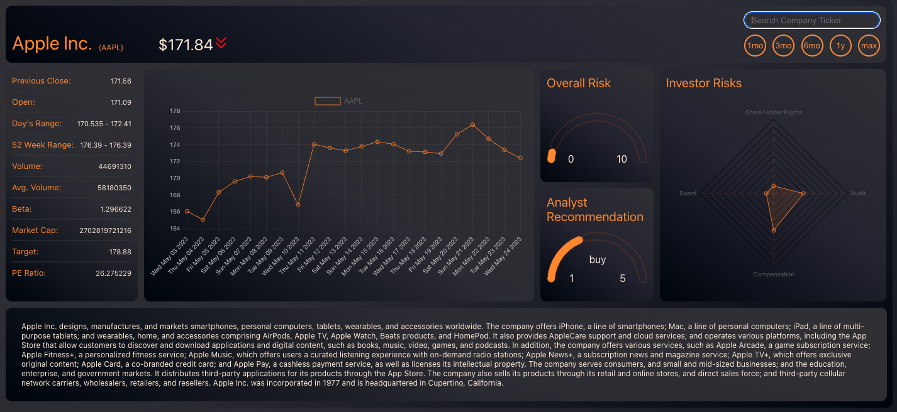

<br/>

# [StockHive](https://stock-hive-fe.vercel.app/) 

### A web application designed to track stocks and provide historical data on stock prices and related information. It is built using the React.js framework for the frontend, Django for the backend, and PostgreSQL as the database.


<br/>

## Features:

1. <strong>Historical Data and Analysis:</strong> The web app provides historical stock data and offers tools for users to analyze stock performance over time. This includes interactive charts and technical indicators to aid in decision-making.

2. <strong>Stock Search:</strong> Users can search for specific stocks by their ticker symbols. The app will retrieve relevant stock information from an external API and display it to the user.

3. <strong>User Registration and Authentication:</strong> Users can create an account and securely authenticate themselves to access the stock tracking features.

<br/>



<br/>

## Technologies Used:

- <strong>Frontend:</strong> React.js, HTML, CSS, JavaScript, Chart.js
- <strong>Backend:</strong> Django, Python
- <strong>Database:</strong> PostgreSQL
- <strong>Deployment:</strong> [Vercel](https://vercel.com/)  (Frontend), [Render](https://render.com/) (Backend / Database)

<br/>

## Setup and Installation:

1. <strong>Fork and Clone both repositories</strong>
2. <strong>Navigate to project directory:</strong> ```$ cd lib```
3. <strong>Install Frontend dependencies:</strong> ```$ npm install```
4. <strong>Install Backend dependencies:</strong> ```$ pip install -r requirements.txt```
5. <strong>Start Frontend Server:</strong> ```$ npm start```
6. <strong>Start Backend Server:</strong> ```$ python3 manage.py runserver```
7. <strong>Access the web app in your browser:</strong> [localhost:3000](http://localhost:3000/)

#### Please note that additional setup steps and configuration may be required depending on your development environment and deployment platform.

<br/>

## Later Additions:

- User favorites and favorited stock hot bar
- Paper trading
- AI stock predictions


## Contribution:

### Contributions to the project are welcome! If you find any bugs or want to add new features, feel free to open an issue or submit a pull request. 

<br/>

[](https://stock-hive-fe.vercel.app/)
[](https://github.com/evRook/StockHive-FE/issues)
### Frontend:


- [Deployed Vercel App](https://stock-hive-fe.vercel.app/)
- [Front End Repository](https://github.com/evRook/StockHive-FE)
- [Issue Tracker](https://github.com/evRook/StockHive-FE/issues)

### Backend: 

- [Deployed Render App](https://stockhive-be.onrender.com/ticker)
- [Back End Repository](https://github.com/evRook/StockHive-BE)
- [Issue Tracker](https://github.com/evRook/StockHive-BE/issues)

<br/>

### Built With:

 


<br/>

#### Resources:
- [Badges 4](https://github.com/alexandresanlim/Badges4-README.md-Profile)

<br/>

### Author:


 [evRook](https://github.com/evRook) | Eric Spychalski